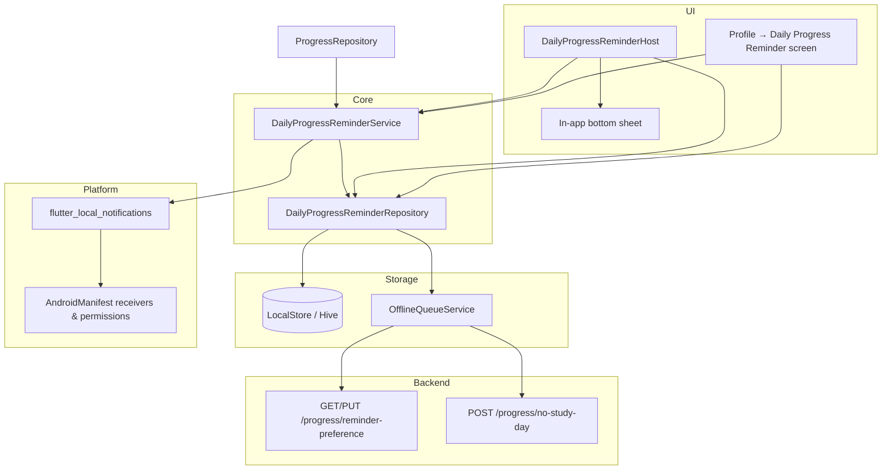
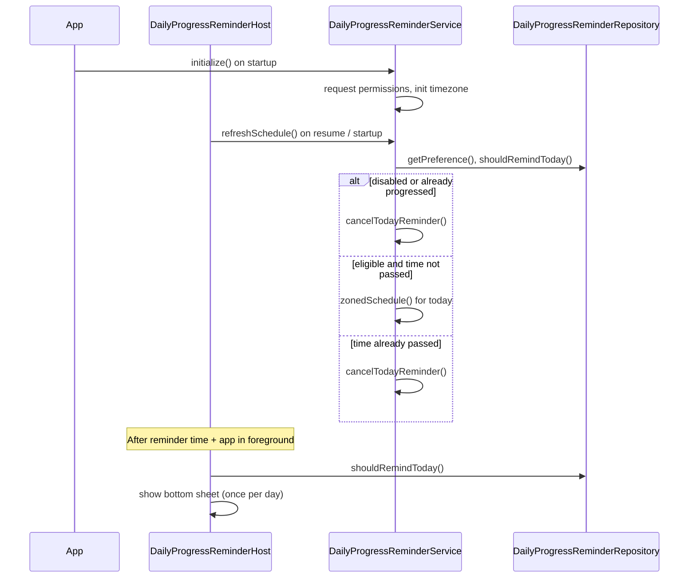

# Daily Progress Reminder (Android)

ExamSaathi nudges students once per day if they have not logged study hours or completed any topics. The feature is **offline-first**: preferences and “no study day” actions are stored locally and synced to the backend when connectivity returns.

> **Platform support:** Fully implemented on **Android** and **iOS**. Disabled on **web** (`kIsWeb` guards in the notification service).

---

## What it does

1. At a user-chosen time (default **10:00 PM**), the app checks whether the student logged progress today.
2. If **no progress** and **no “didn’t study”** mark exists, it delivers a reminder.
3. The student can:
   - **Update Progress** → opens the subjects screen
   - **Didn’t Study** → records a no-study day and cancels today’s notification
4. Once the student logs hours or completes a topic today, the reminder is **automatically cancelled**.

---

## Architecture



---

## Key files

| File | Role |
|------|------|
| `lib/core/reminders/daily_progress_reminder_service.dart` | Notification scheduling, permissions, action handling, in-app sheet UI |
| `lib/data/repositories/daily_progress_reminder_repository.dart` | Local preference cache, eligibility checks, offline queue flush |
| `lib/data/models/daily_progress_reminder_model.dart` | `DailyProgressReminderPreference` model (enabled, hour, minute) |
| `lib/presentation/screens/profile/daily_progress_reminder_screen.dart` | Settings UI (toggle + time picker) |
| `lib/presentation/screens/reminders/daily_progress_reminder_intro_screen.dart` | One-time dashboard intro before permission prompt |
| `lib/presentation/screens/dashboard/dashboard_screen.dart` | Presents intro after dashboard loads |
| `lib/core/di/injection_container.dart` | Registers repository + service in GetIt |
| `lib/main.dart` | Initializes service on startup; wraps app in `DailyProgressReminderHost` |
| `lib/core/router/app_router.dart` | Route: `/daily-progress-reminder` |
| `lib/data/repositories/progress_repository.dart` | Cancels today’s reminder when progress is logged |
| `lib/core/sync/sync_service.dart` | Flushes queued reminder preference & no-study-day items |
| `android/app/src/main/AndroidManifest.xml` | Permissions and notification receivers |
| `android/app/build.gradle.kts` | Core library desugaring (required by `flutter_local_notifications`) |

---

## User flow

### Configure reminder

**Profile → Daily Progress Reminder**

- Toggle **Enable Reminder** (requests notification permission the first time you turn it on)
- Pick reminder time via system time picker
- Settings are saved to `LocalStore` (`daily_progress_reminder_settings`) and enqueued for backend sync

### Permission UX (opt-in)

- **No permission prompt** on app launch, login, signup, onboarding, or first install.
- After the user reaches the **Dashboard**, a one-time **Daily Progress Reminder** intro screen explains the feature.
- Tapping **Enable Reminder** on that screen (or turning the toggle on in Settings) is the only time the app requests notification permission.
- If permission is denied, the app continues normally; the user can try again later from **Profile → Daily Progress Reminder**.
- If permission is granted from the intro screen, the reminder is enabled and the settings screen opens automatically.

### Daily eligibility (`shouldRemindToday`)

A reminder is shown **only if all** of the following are true:

| Check | Source |
|-------|--------|
| Reminder enabled | `DailyProgressReminderPreference.enabled` |
| No “didn’t study” for today | `daily_no_study_days` or `daily_study_logs.noStudyDay` |
| No progress today | `daily_study_logs` — `hoursStudied > 0` OR `topicsCompleted > 0` |

### Delivery paths

**A. Scheduled local notification (background / app killed)**

- Uses `flutter_local_notifications` with notification ID `2200`
- Channel: `daily_progress_reminder`
- Actions: **Didn’t Study**, **Update Progress**
- Title: *Daily Progress Reminder*
- Body: *Looks like you haven't added any study progress today.*

**B. In-app bottom sheet (foreground)**

- `DailyProgressReminderHost` runs `_tick()` on startup and when the app resumes
- After the configured time, if still eligible, shows the same choices in a modal sheet

### After user action

| Action | Result |
|--------|--------|
| **Didn’t Study** | Writes local no-study record, enqueues `NO_STUDY_DAY`, cancels notification |
| **Update Progress** | Navigates to `/subjects` |
| Logs study hours / completes topic | `ProgressRepository` calls `cancelTodayReminder()` |

---

## Android integration

### Dependencies (`pubspec.yaml`)

```yaml
flutter_local_notifications: ^19.5.0
timezone: ^0.10.1
flutter_timezone: ^5.1.0
```

### Permissions (`AndroidManifest.xml`)

| Permission | Purpose |
|------------|---------|
| `POST_NOTIFICATIONS` | Show notifications (Android 13+) |
| `RECEIVE_BOOT_COMPLETED` | Reschedule after device reboot |
| `SCHEDULE_EXACT_ALARM` | Fire at the exact chosen time when permitted |

### Broadcast receivers

Registered for `flutter_local_notifications`:

- `ScheduledNotificationReceiver` — fires scheduled notifications
- `ScheduledNotificationBootReceiver` — restores schedules after boot / app update
- `ActionBroadcastReceiver` — handles notification action buttons

### Exact vs inexact alarms

On Android 12+, exact alarms require user approval. The service:

1. Requests notification + exact-alarm permissions on init
2. Uses `AndroidScheduleMode.exactAllowWhileIdle` when `canScheduleExactNotifications()` is true
3. Falls back to `AndroidScheduleMode.inexactAllowWhileIdle` otherwise (logged as a warning)

### Desugaring

`android/app/build.gradle.kts` enables core library desugaring — required for Java 8+ time APIs used by the notifications plugin:

```kotlin
compileOptions {
    isCoreLibraryDesugaringEnabled = true
}
dependencies {
    coreLibraryDesugaring("com.android.tools:desugar_jdk_libs:2.1.5")
}
```

---

## Backend API

| Method | Endpoint | Description |
|--------|----------|-------------|
| `GET` | `/api/v1/progress/reminder-preference` | Fetch saved preference |
| `PUT` | `/api/v1/progress/reminder-preference` | Save preference |
| `POST` | `/api/v1/progress/no-study-day` | Record a no-study day |

**Preference payload:**

```json
{
  "enabled": true,
  "reminderTime": "22:00"
}
```

User profile fields (`dailyProgressReminderEnabled`, `dailyProgressReminderTime`) are also read as a fallback when local settings have not been cached yet.

Backend implementation: `StudyProgressService` / `ProgressController` in `backend_springboot`.

---

## Offline sync

| Queue entity | Action | Flush handler |
|--------------|--------|---------------|
| `REMINDER_PREFERENCE` | `DAILY_PROGRESS_REMINDER` | `PUT /progress/reminder-preference` |
| `NO_STUDY_DAY` | `NO_STUDY_DAY` | `POST /progress/no-study-day` |

`SyncService` calls `flushQueuedPreference()` and `flushQueuedNoStudyDay()` when processing the offline queue.

---

## Scheduling lifecycle



`refreshSchedule()` is invoked when:

- User saves settings on the reminder screen
- App resumes (`DailyProgressReminderHost.didChangeAppLifecycleState`)
- First frame after host mounts

---

## Defaults

| Setting | Default |
|---------|---------|
| Enabled | `true` |
| Time | `22:00` (10:00 PM) |
| Notification ID | `2200` |

---

## Testing on Android

1. Install a debug/release build on a physical device or emulator (API 33+ recommended for notification permission flow).
2. Open **Profile → Daily Progress Reminder**, enable, set time **1–2 minutes ahead**.
3. Ensure you have **not** logged study today.
4. Background the app and wait for the notification, **or** keep it foreground to see the bottom sheet after the time passes.
5. Log a topic or study hours → confirm no further reminder for that day.
6. Tap **Didn’t Study** → confirm notification cancelled and no-study day stored.

**Log tags:** Filter logcat for `[DailyReminder]` — the service logs schedule mode, pending notification IDs, skip/cancel reasons.

**Permissions to verify manually (Settings → Apps → ExamSaathi):**

- Notifications: allowed
- Alarms & reminders (exact alarms): allowed (Android 12+)

---

## Known limitations

- **Web:** Notifications are skipped entirely (`kIsWeb` checks).
- **Inexact alarms:** Without exact-alarm permission, delivery time may drift on some OEM devices.
- **Reschedule after reboot:** Boot receiver is registered; schedule is refreshed when the app next opens or resumes.
- **No dedicated unit tests** yet for reminder logic in `test/`.

---

## Related commits

Recent Android hardening (receivers, exact alarms, logging):

- `Improve daily progress reminder scheduling on Android` (`0ba7853` on `exam-sathi-flutter`)
